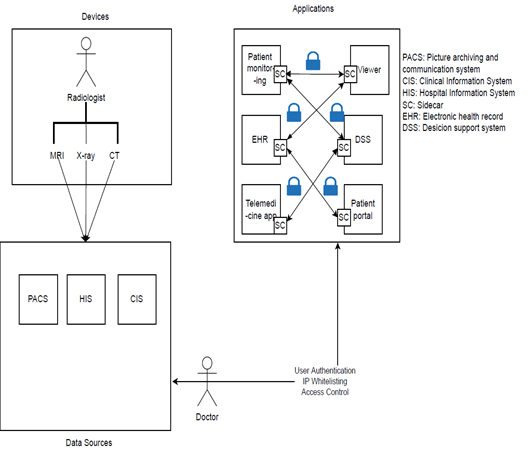
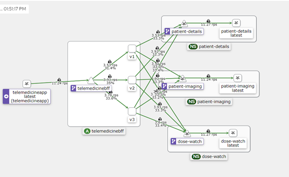

#  Zero Trust Security Implementation in Healthcare

##  Overview

This project demonstrates a Zero Trust Security model tailored for healthcare environments using modern cloud-native tools. It emphasizes "never trust, always verify" principles to protect sensitive patient data across interconnected microservices.

## Objectives

- Eliminate implicit trust in networks, devices, and users.
- Implement mutual TLS (mTLS) and secure service-to-service communication.
- Enforce least privilege and fine-grained access control.
- Enable observability, traffic control, and fault injection for proactive security.
- Deploy healthcare microservices on Kubernetes using Istio service mesh.

## Architecture Overview

The architecture consists of four microservices communicating through a service mesh:

- Patient Details
- DoseWatch
- Patient Imaging
- Telemedicine BFF (Backend-for-Frontend)

Each microservice is containerized, deployed via Kubernetes, and secured using Istio and SPIRE/SPIFFE.

### Block Diagram of Telemedicine Architecture

##  Microservices Overview

Each microservice performs a specific function in the telemedicine application:

-  Patient Details
  Collects and stores patient information such as name, age, contact details, address, and insurance ID in a PostgreSQL database.

-  DoseWatch 
  Handles prescription records by updating medications and treatment durations prescribed to patients based on their diagnosis.

- Patient Imaging
  Retrieves patient imaging data from an Orthanc PACS server and serves metadata and DICOM files via a secure API.

-  Telemedicine BFF (Backend-for-Frontend)
  Aggregates responses from the other three microservices into a single API output tailored for the frontend interface.

## Key Features

### Zero Trust Components

- Authentication: Identity-based access using JWTs and SPIFFE IDs.
- mTLS: Encrypted service-to-service traffic using Istio’s auto mTLS.
- Authorization Policies: Role-based and context-aware access controls.
- SPIRE + SPIFFE: Certificate issuance and management for service identity.

###  Observability

- Distributed Tracing: Jaeger shows how requests flow across services.
- Metrics: Collected with Prometheus and visualized in Grafana.
- Topology View: Kiali provides service graphs, inbound/outbound metrics, and fault injection.

##  Service Graph Visualization

## Deployment

### Local Development
- Used `kind` to spin up a local Kubernetes cluster.
- Applied Istio and deploy microservices using YAML manifests.

### Production Deployment
- Google Kubernetes Engine (GKE)
- Istio Ingress Gateway for external access
- Policies applied via `PeerAuthentication`, `AuthorizationPolicy`, `DestinationRule`

